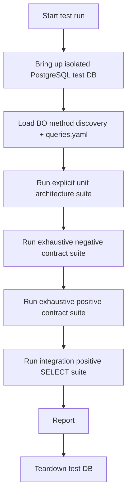

# BO Testing Plan (New Architecture)

## Scope

- Target: `backend/src/bo/<Subsystem>/<Class>/methods/*.js`
- Excludes: archivos no BO y documentación
- Framework: Jest
- DB: isolated Docker test database (`backend/testing/docker-compose.test.yml`)

## Strategy

1. Negative exhaustive (all discovered BO methods): simulate DB failure and verify method rejects.
2. Positive exhaustive contract (all discovered BO methods): mock DB success and verify method resolves.
3. Positive integration (all methods with `SELECT` query): execute real DB query against isolated test DB using generated params.
4. Explicit unit architecture (by subsystem and by class): verify one-to-one subsystem/class structure, named exports, and instantiation contract.

## Folder Layout

- `backend/testing/tests/bo-contract-negative.test.mjs`
- `backend/testing/tests/bo-contract-positive.test.mjs`
- `backend/testing/tests/bo-integration-select-positive.test.mjs`
- `backend/testing/tests/bo-unit-architecture.test.mjs`
- `backend/testing/utils/discovery.mjs`

## Execution Flow

## Run Commands

- `npm run test:bo:setup-db`
- `npm run test:bo`
- `npm run test:bo:teardown-db`
- `npm run test:bo:full`

## Operational Notes

- `test:bo` includes integration tests and requires the test DB to be up.
- For deterministic end-to-end execution, prefer `APP_ENV=test npm run test:bo:full`.
- For handle diagnostics, use `APP_ENV=test npm run test:bo -- --detectOpenHandles` while DB is running.
