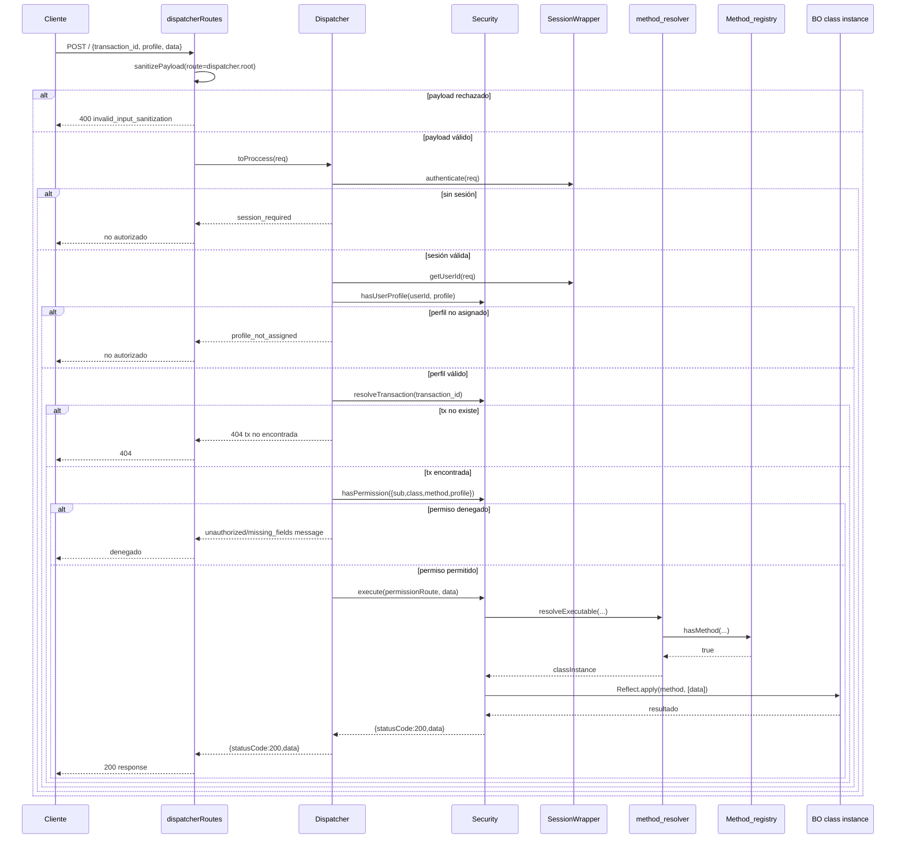

# Flujo Detallado: Dispatcher, Seguridad y Reflexión

## Índice

1. [Resumen ejecutivo del flujo](#resumen-ejecutivo-del-flujo)
2. [Entradas HTTP reales y componentes activos](#entradas-http-reales-y-componentes-activos)
3. [Flujo paso a paso: desde request hasta respuesta](#flujo-paso-a-paso-desde-request-hasta-respuesta)
4. [Diagrama de secuencia del flujo principal](#diagrama-de-secuencia-del-flujo-principal)
5. [Detalle de reflexión y resolución dinámica](#detalle-de-reflexión-y-resolución-dinámica)
6. [Flujos de error y códigos de salida observables](#flujos-de-error-y-códigos-de-salida-observables)
7. [Notas de consistencia y comportamiento actual](#notas-de-consistencia-y-comportamiento-actual)
8. [Referencias](#referencias)
9. [Nota de migración \_business -> bo](#nota-de-migración-_business---bo)

## Resumen ejecutivo del flujo

El flujo operativo vigente para autorización y ejecución está centrado en:

1. Sanitización de payload (`dispatcherRoutes`).
2. Verificación de sesión (`SessionWrapper`).
3. Verificación de perfil por usuario (`Security.userProfiles`).
4. Resolución de `transaction_id` a ruta ejecutable (`Security.transactions`).
5. Verificación de permiso por método/perfil (`Security.permissions`).
6. Resolución dinámica de clase y ejecución del método mediante reflexión (`resolveExecutable` + `Reflect.apply`).

## Entradas HTTP reales y componentes activos

### Router activo en runtime

- El servidor registra `dispatcherRouter` en `/`, por lo que el endpoint operativo es `POST /` en el router de dispatcher.
- Este router sí aplica sanitización por `routeKey = dispatcher.root`.

### Router alterno (legacy)

- Existe un `controller/dispatcher_controller.js` con endpoints `/dispatcher`, `/dispatcher/status`, `/dispatcher/check-permission`.
- En el servidor activo no se monta este router legacy.

## Flujo paso a paso: desde request hasta respuesta

### Paso 0: Llegada al router

El request entra por `POST /` del router de dispatcher.

- Se invoca `sanitizePayload` con `routeKey = dispatcher.root`.
- Si hay patrón denegado, se responde `400` con detalle de reglas/campos.
- Si no hay rechazo, el payload sanitizado reemplaza `req.body`.

### Paso 1: Preparación de datos de despacho

`Dispatcher.toProccess(request)` extrae:

- `lang`
- `transaction_id` (tx lógica de negocio)
- `data` (parámetros del método)
- `profile` (perfil pretendido para la ejecución)

### Paso 2: Autenticación de sesión

`SessionWrapper.authenticate(req)` exige `req.session.data.user`.

- Si no existe sesión, retorna mensaje de `session_required`.
- En el router dispatcher, ese string termina en respuesta HTTP no-200.

### Paso 3: Validaciones de request

Se valida que exista:

- `transaction_id`
- `profile`

Si falta alguno, retorna objeto con `statusCode` y `message`.

### Paso 4: Validación de perfil de usuario

Se obtiene identidad con `SessionWrapper.getUserId(req)`:

- prioriza `user.id`, luego `user.username`, luego `user.user_id`.

Luego `Security.hasUserProfile(userId, profile)` consulta el mapa `userProfiles`.

- Si no existe relación usuario-perfil, se retorna `profile_not_assigned`.

### Paso 5: Resolución de transacción

`Security.resolveTransaction(txId)` busca en el mapa `transactions` la ruta:

- `subsystem`
- `class`
- `method`

Si no existe, retorna `404` con mensaje de transacción no encontrada.

### Paso 6: Verificación de permiso por método/perfil

Se crea un `permission` temporal con la ruta de transacción + perfil del request.

`Security.hasPermission(permission)`:

- normaliza campos,
- construye clave `subsystem::class::method::profile` en minúsculas,
- verifica existencia en `permissions`.

Si falla, se retorna mensaje de denegación (actualmente usa clave de mensaje genérica).

### Paso 7: Ejecución autorizada

`Security.execute(permissionRoute, parameters)`:

1. Normaliza permiso.
2. Llama `resolveExecutable({ subsystem, className, method })`.
3. Obtiene instancia de clase BO.
4. Ejecuta por reflexión:

```js
Reflect.apply(actionInstance[method], actionInstance, [reqBody]);
```

5. Envuelve respuesta:

- `statusCode: 200`
- `data: resultado`
- `message: Ejecutado exitosamente`

### Paso 8: Respuesta HTTP

`dispatcherRoutes` toma `result.statusCode || 200` y responde JSON con ese payload.

## Diagrama de secuencia del flujo principal



## Detalle de reflexión y resolución dinámica

La reflexión funciona en dos capas:

1. Registro y validación previa de ruta (`Method_registry`).
2. Ejecución dinámica (`method_resolver` + `Reflect.apply`).

### Registro de métodos

`Method_registry.initialize()`:

- Recorre `src/bo/subsystem/*.js`.
- Importa cada módulo.
- Instancia la clase de subsistema.
- Recorre propiedades que representan clases internas.
- Instancia cada clase interna y registra sus métodos como booleanos.

Resultado: objeto `mapFiles` con forma:

```txt
{
  Security: {
    person: { createPerson: true },
    profile: { createProfile: true, assignProfileToUser: true, getProfileByName: true }
  }
}
```

### Resolución ejecutable

`resolveExecutable`:

1. Si `registry.getMap()` está vacío, ejecuta `registry.init()`.
2. Valida existencia con `registry.hasMethod(...)` (case-insensitive).
3. Importa módulo `./subsystem/${subsystem}.js`.
4. Instancia clase de subsistema exportada.
5. Busca propiedad de clase interna por comparación case-insensitive.
6. Retorna `new InnerClassRef()`.

### Ejecución por Reflect

En `Security.execute`, la invocación se hace con `Reflect.apply` sobre el método seleccionado.

Este punto es la ejecución final de la ruta autorizada.

## Flujos de error y códigos de salida observables

1. Sanitización rechaza payload
   `400` con `INVALID_INPUT_SANITIZATION`.

2. Sin sesión o sin perfil/permiso
   Se retorna mensaje de negocio; el estatus HTTP depende del router que reciba el resultado.

3. `transaction_id` no mapeado
   `404`.

4. Error en reflexión/import dinámico
   Se propaga excepción y termina en `500`.

## Notas de consistencia y comportamiento actual

1. El servidor inicializa mapas al arranque en orden: permisos -> transacciones -> perfiles.
2. `syncPermissions()` ya llama internamente `syncUserProfiles()`, por lo que hay sincronización repetida de perfiles en `Server.init()`.
3. Hay coexistencia de router activo (`src/dispatcher`) y controlador legacy (`controller/dispatcher_controller.js`).
4. La respuesta de permiso denegado en `Dispatcher.toProccess` usa una clave de mensaje genérica.

## Referencias

- [00-indice-general.md](./00-indice-general.md)
- [02-mapas-perfiles-metodos-opciones.md](./02-mapas-perfiles-metodos-opciones.md)
- [03-analisis-clean-architecture.md](./03-analisis-clean-architecture.md)
- [04-plan-migracion-business-a-bo.md](./04-plan-migracion-business-a-bo.md)

## Nota de migración \_business -> bo

- El flujo de este documento describe el runtime activo de autorización/dispatch.
- Paralelamente existe un ecosistema legacy en `src/_business` (ATX, helpers, ftx) que será migrado.
- El objetivo funcional final es centralizar el modelo en `src/bo` con organización `subsystem/class/method`.
- El plan de ejecución y reglas de diseño para esa migración está en [04-plan-migracion-business-a-bo.md](./04-plan-migracion-business-a-bo.md).
