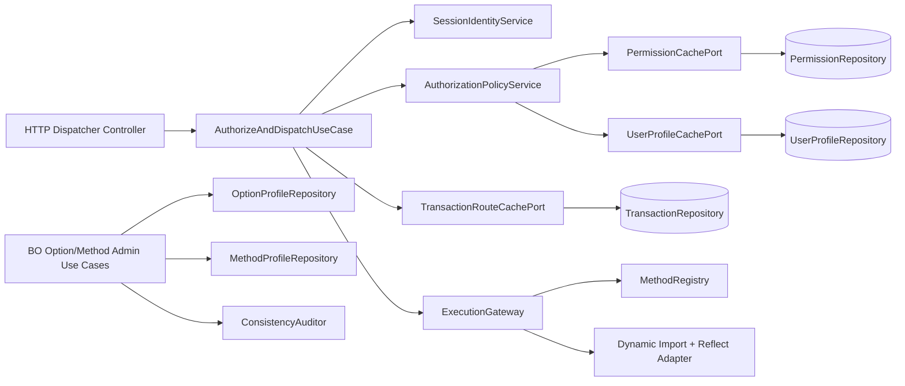

# Análisis Exhaustivo y Sugerencias de Clean Architecture

## Índice

1. [Contexto del análisis](#contexto-del-análisis)
2. [Hallazgos críticos](#hallazgos-críticos)
3. [Hallazgos importantes](#hallazgos-importantes)
4. [Hallazgos de mantenibilidad y claridad](#hallazgos-de-mantenibilidad-y-claridad)
5. [Arquitectura objetivo propuesta](#arquitectura-objetivo-propuesta)
6. [Plan de migración por fases](#plan-de-migración-por-fases)
7. [Contratos sugeridos para mapas y políticas](#contratos-sugeridos-para-mapas-y-políticas)
8. [Diagrama de arquitectura objetivo](#diagrama-de-arquitectura-objetivo)
9. [Checklist de mejora priorizada](#checklist-de-mejora-priorizada)
10. [Referencias](#referencias)
11. [Alineación con decisión de migración](#alineación-con-decisión-de-migración)

## Contexto del análisis

Se analizó el flujo operativo actual (dispatcher + security + resolver) y su operación en modo BO-only.

El objetivo de estas sugerencias es:

- desacoplar responsabilidades,
- evitar ambigüedad de rutas y contratos,
- mejorar testabilidad y observabilidad,
- mantener coherencia entre autorización por método y autorización por opción.

## Hallazgos críticos

1. Manejo de errores inconsistente en resolución dinámica.
   En `resolveExecutable`, ante error se usa `utils.handleError(...)` que lanza excepción serializada como string JSON. El consumidor final (`Security.execute`) no diferencia tipos de error de dominio/infraestructura.

2. Hallazgo histórico ya cerrado: resolución de tx en helper legacy.
   El riesgo pertenecía a un helper de `_business`, retirado del runtime actual.

3. Riesgo de consistencia en naming de joins.
   Debe mantenerse una convención única de columnas (`*_id`) en queries y documentación para evitar desalineaciones.

4. Duplicidad de superficies HTTP para dispatcher.
   Coexisten router activo (`src/dispatcher`) y controlador legacy (`controller/dispatcher_controller.js`) con contratos distintos, lo que complica gobernanza y trazabilidad.

## Hallazgos importantes

1. Sincronización de caches redundante.
   `syncPermissions()` ya sincroniza perfiles, y además `Server.init()` vuelve a llamar `syncUserProfiles()`.

2. Mensajes de denegación poco semánticos.
   En denegación por permiso, `Dispatcher.toProccess` retorna una clave de mensaje genérica que no representa explícitamente “no autorizado”.

3. Convenciones de casing distribuidas.
   Parte del sistema normaliza a minúscula, parte depende de resolución case-insensitive en registro. Falta una política central.

4. Hallazgo histórico ya cerrado: datos no utilizados en parser ATX.
   `parseMOP` pertenecía al ecosistema legacy removido.

## Hallazgos de mantenibilidad y claridad

1. Mezcla de responsabilidades en `Security`:
   cache + sincronización DB + autorización + ejecución por reflexión.

2. Contratos implícitos entre capas:
   DTOs de permiso/transacción/opción no están tipados formalmente ni validados de manera uniforme.

3. Nombres y ortografía de API:
   `toProccess` conserva typo histórico, lo cual complica discoverability.

4. Cobertura de pruebas desactualizada:
   `test_security.js` referencia `executeAuthorized`, método no presente en implementación actual.

## Arquitectura objetivo propuesta

### Separar por casos de uso y puertos

1. Capa `Application` (casos de uso)
   - `AuthorizeAndDispatchUseCase`
   - `CheckPermissionUseCase`
   - `SyncSecurityCachesUseCase`

2. Capa `Domain`
   - `PermissionKeyFactory`
   - `AuthorizationPolicyService`
   - `ProfileAssignmentPolicyService`

3. Capa `Infrastructure`
   - `PermissionRepository` (DB/CSV adapters)
   - `TransactionRepository`
   - `UserProfileRepository`
   - `ExecutableResolver` (reflection adapter)

4. Capa `Interface`
   - routers/controladores HTTP con DTO validation explícita.

### Unificar autorización de método y opción

Introducir una política explícita de autorización multimodelo:

- `canExecuteMethod(user, tx)` (ruta actual).
- `canUseOption(user, option)` (menú/opciones).

Y definir una regla de consistencia:

- si una opción referencia `tx`, entonces `option_profile` y `method_profile` deben estar alineados (auditoría de integridad periódica).

## Plan de migración por fases

### Fase 1: endurecimiento sin romper API

1. Normalizar errores con clases de error de dominio (`NotAuthorizedError`, `RouteNotFoundError`, etc.). Estos errores deben estar definidos en el config.js
2. Corregir `_resolveTxFromMethodRef` para no depender de `this` implícito.
3. Consolidar endpoint de dispatcher y retirar superficie HTTP obsoleta.
4. Corregir naming de mensaje de denegación.

### Fase 2: desacople interno

1. Extraer `SecurityCacheService` de `Security`.
2. Extraer `ExecutionGateway` para reflection/import dinámico.
3. Definir interfaces de repositorio para permisos, perfiles y transacciones.

### Fase 3: gobierno de permisos y opciones

1. Crear proceso de reconciliación de integridad:
   compara `method_profile` vs `option_profile` para opciones con `tx`.
2. Publicar contrato único de nombres de columnas y DTOs.
3. Añadir pruebas de contrato (contract tests) entre BO y queries.

### Fase 4: observabilidad y operaciones

1. Métricas: cache hit/miss de permisos, latencia de resolveExecutable, errores por tipo.
2. Logging estructurado con `requestId`, `txId`, `profile`, `resolvedRoute`.
3. Estrategia de refresh de cache por evento (evitar reinicio para cambios de permisos).

## Contratos sugeridos para mapas y políticas

### Contrato PermissionKey

```txt
PermissionKey = lower(subsystem) + '::' + lower(class) + '::' + lower(method) + '::' + lower(profile)
```

### Contrato TransactionRoute

```txt
TransactionRoute = {
  id: string,
  subsystem: string,
  className: string,
  methodName: string
}
```

### Contrato OptionBinding

```txt
OptionBinding = {
  optionName: string,
  tx?: number,
  allowedProfiles: string[]
}
```

## Diagrama de arquitectura objetivo



## Checklist de mejora priorizada

1. Corregir bug potencial de `this` en `_resolveTxFromMethodRef`.
2. Unificar punto de entrada dispatcher y retirar controlador obsoleto.
3. Estandarizar mensajes de autorización denegada.
4. Crear clases de error de dominio y mapeo HTTP determinístico.
5. Definir contrato único de columnas para joins (`id_*` vs `*_id`).
6. Extraer servicios dedicados de cache y ejecución.
7. Añadir pruebas de regresión para:
   sesión, perfil, permiso, tx inexistente, method resolver, errores de reflection.
8. Añadir auditoría de consistencia opción->tx->método->perfil.

## Referencias

- [00-indice-general.md](./00-indice-general.md)
- [01-flujo-dispatcher-security.md](./01-flujo-dispatcher-security.md)
- [02-mapas-perfiles-metodos-opciones.md](./02-mapas-perfiles-metodos-opciones.md)
- [04-plan-migracion-business-a-bo.md](./04-plan-migracion-business-a-bo.md)

## Alineación con decisión de migración

El análisis de esta guía queda alineado con la decisión de producto/arquitectura:

1. `src/_business` fue retirado del runtime y del repositorio activo.
2. `src/bo` es la arquitectura vigente y único destino de evolución.
3. El patrón estructural canónico es `subsystem -> class -> method`.
4. La carpeta `method` queda reservada para unidades stateless, compartidas entre clases y sin retención de estado.

El detalle operativo de ejecución de esta transición está en [04-plan-migracion-business-a-bo.md](./04-plan-migracion-business-a-bo.md).
