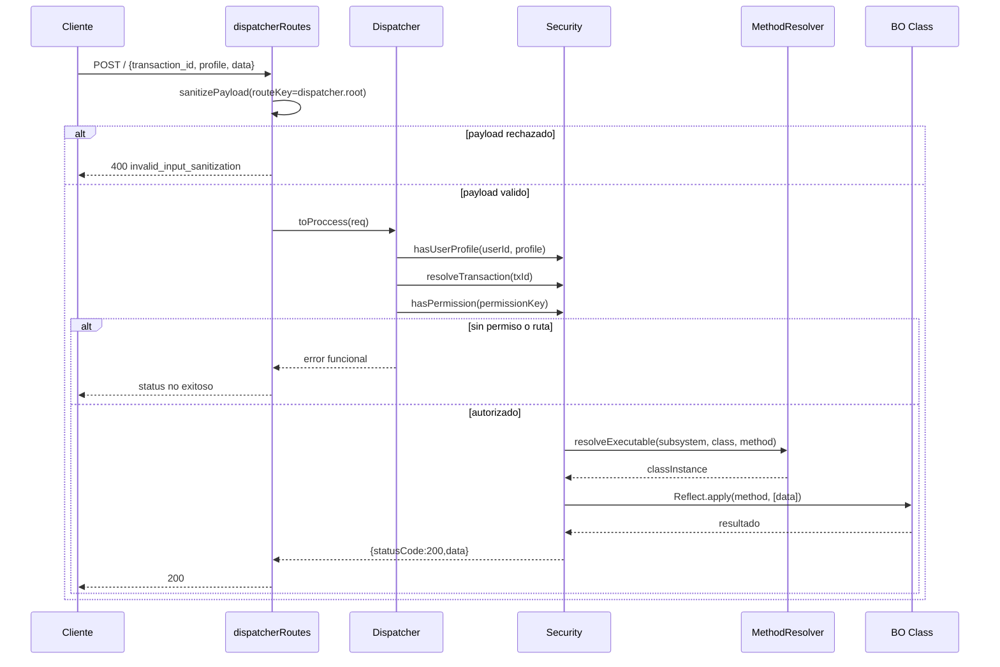

# Contexto y Lectura Rapida del Estado Actual

## Indice

1. [Objetivo](#objetivo)
2. [Fuentes revisadas](#fuentes-revisadas)
3. [Fotografia de arquitectura actual](#fotografia-de-arquitectura-actual)
4. [Flujo operativo actual de dispatch](#flujo-operativo-actual-de-dispatch)
5. [Estado de base de datos](#estado-de-base-de-datos)
6. [Fortalezas detectadas](#fortalezas-detectadas)
7. [Brechas y deuda tecnica](#brechas-y-deuda-tecnica)
8. [Implicaciones para la propuesta](#implicaciones-para-la-propuesta)
9. [Referencias](#referencias)

## Objetivo

Consolidar una lectura rapida, clara y accionable de la arquitectura real del sistema para fundamentar las decisiones de la propuesta objetivo.

## Fuentes revisadas

1. [docs/database-refactor.md](../database-refactor.md)
2. [docs/env-integration.md](../env-integration.md)
3. [docs/logger-design.md](../logger-design.md)
4. [docs/sanitizer-design.md](../sanitizer-design.md)
5. [docs/permissions-mapas/01-flujo-dispatcher-security.md](../permissions-mapas/01-flujo-dispatcher-security.md)
6. [docs/permissions-mapas/02-mapas-perfiles-metodos-opciones.md](../permissions-mapas/02-mapas-perfiles-metodos-opciones.md)
7. [docs/permissions-mapas/03-analisis-clean-architecture.md](../permissions-mapas/03-analisis-clean-architecture.md)
8. [backend/src/dispatcher/dispatcherRoutes.js](../../backend/src/dispatcher/dispatcherRoutes.js)
9. [backend/src/dispatcher/dispatcher.js](../../backend/src/dispatcher/dispatcher.js)
10. [backend/src/security/security.js](../../backend/src/security/security.js)
11. [backend/src/bo/method_registry.js](../../backend/src/bo/method_registry.js)
12. [backend/src/bo/method_resolver.js](../../backend/src/bo/method_resolver.js)
13. [backend/config/queries.yaml](../../backend/config/queries.yaml)
14. [db-win/schema.sql](../../db-win/schema.sql)
15. [db-win/initial_data.sql](../../db-win/initial_data.sql)

## Fotografia de arquitectura actual

### 1) Front door HTTP

1. El endpoint principal de despacho operativo es POST / en router dispatcher.
2. El request es sanitizado antes de pasar a negocio.
3. Luego se delega a la clase Dispatcher para autorizacion y ejecucion.

### 2) Seguridad runtime

1. SessionWrapper valida identidad en sesion activa.
2. Security valida que el usuario tenga perfil asignado.
3. Security resuelve transaction_id a subsystem/class/method.
4. Security valida permiso por clave normalizada subsystem::class::method::profile.
5. Security ejecuta dinamicamente el metodo autorizado.

### 3) Ejecucion dinamica

1. Method registry construye mapa de metodos disponibles por inspeccion.
2. Method resolver importa el subsistema requerido y retorna instancia de clase.
3. Execute invoca el metodo por Reflect.apply.

### 4) Persistencia

1. Queries SQL centralizadas en YAML.
2. Permisos, perfiles y transacciones persisten en tablas dedicadas.
3. Hay estrategia de sincronizacion de permisos CSV -> DB.

## Flujo operativo actual de dispatch

## Estado de base de datos

### 1) Cobertura funcional de tablas

1. Inventario y catalogos: category, item, feature, inventory, location.
2. Flujo de prestamos: movement, movement_detail, return_status.
3. Mantenimiento y compensacion: maintenance_log, compensation, payment_method_type.
4. Seguridad y autorizacion: user, profile, user_profile, subsystem, class, method, transaction, method_profile.
5. Auditoria y notificaciones: audit, notification y catalogos tipo.

### 2) Integridad

1. Amplio uso de FK y checks de no vacio/no negativos.
2. Soporte de soft delete en entidades criticas.
3. Triggers de updated_at para trazabilidad temporal.

### 3) Seeds base

1. initial_data.sql inserta catalogos idempotentes y perfiles base.
2. Incluye usuario administrador por defecto con profile admin.

## Fortalezas detectadas

1. Modelo relacional bien orientado para trazabilidad.
2. Mecanismo de autorizacion transaccional existente.
3. Sanitizacion de payloads ya integrada en puntos criticos.
4. Ruta de migracion definida de legacy hacia bo.
5. Contratos de entorno centralizados por APP_ENV.

## Brechas y deuda tecnica

1. Security esta sobrecargado (cache + sync + autorizacion + ejecucion).
2. Coexistencia de piezas legacy y nuevas puede confundir ownership.
3. Resolucion dinamica requiere endurecimiento de errores y tipado de contratos.
4. Mensajeria de denegacion no siempre semantica.
5. Faltan metodos de dominio para cubrir el set completo de procesos minimos.

## Implicaciones para la propuesta

1. No se recomienda redisenar desde cero.
2. Se recomienda evolucion incremental bo-first con cortes por lote.
3. El esquema actual permite implementar clean architecture sin migraciones destructivas inmediatas.
4. La prioridad tecnica es separar orquestacion, politicas de dominio, adaptadores y estado interno.

## Referencias

1. [00-indice-general.md](./00-indice-general.md)
2. [02-mapa-procesos-minimos-y-bd.md](./02-mapa-procesos-minimos-y-bd.md)
3. [03-arquitectura-objetivo-clean.md](./03-arquitectura-objetivo-clean.md)
4. [04-subsistemas-clases-metodos.md](./04-subsistemas-clases-metodos.md)
