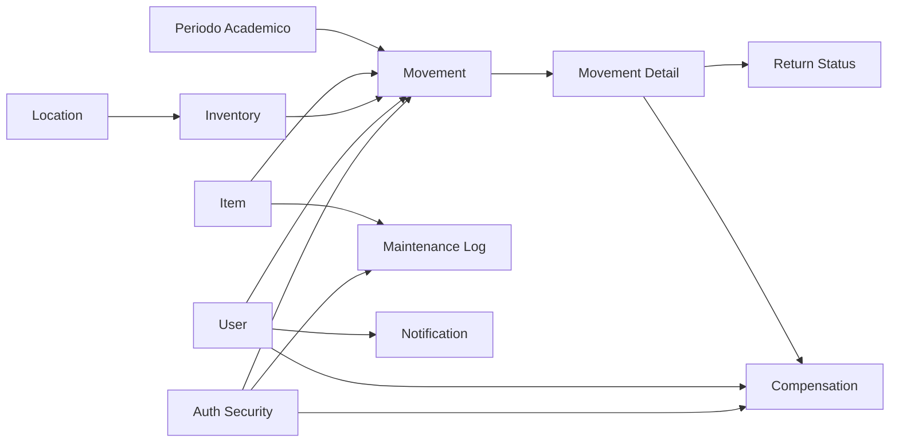

# Mapa de Procesos Minimos y Trazabilidad con Base de Datos

## Indice
1. [Objetivo](#objetivo)
2. [Catalogo de procesos minimos](#catalogo-de-procesos-minimos)
3. [Matriz proceso-tablas-reglas](#matriz-proceso-tablas-reglas)
4. [Invariantes por proceso](#invariantes-por-proceso)
5. [Dependencias cruzadas entre procesos](#dependencias-cruzadas-entre-procesos)
6. [Riesgos de integridad por proceso](#riesgos-de-integridad-por-proceso)
7. [Sugerencias de hardening por proceso](#sugerencias-de-hardening-por-proceso)
8. [Referencias](#referencias)

## Objetivo
Construir la trazabilidad detallada entre procesos de negocio obligatorios y el modelo de datos existente para asegurar cobertura funcional completa.

## Catalogo de procesos minimos
Fuente: [ai/processes.txt](../../ai/processes.txt)

1. Mantenimiento de equipos.
2. Mantenimiento de componentes.
3. Prestamos.
4. Apartado de componentes o equipos.
5. Devolucion de prestamos.
6. Control de estado de equipos y componentes.
7. Compensacion por danos.
8. Notificaciones de recordatorio y retraso.
9. Inventario de componentes.
10. Inventario de equipos.
11. Mantenimiento de ubicacion de equipos.
12. Mantenimiento de ubicacion de componentes.
13. Reportes de solvencia, morosos y estadistica.
14. Auditoria.
15. Mantenimiento de seguridad.
16. Mantenimiento de periodo academico.

## Matriz proceso-tablas-reglas
| Proceso | Tablas principales | Tablas soporte | Regla clave |
|---|---|---|---|
| Mantenimiento equipos | maintenance_log, item | user, inventory | end_date >= start_date |
| Mantenimiento componentes | maintenance_log, item | inventory, user | item_id obligatorio |
| Prestamos | movement, movement_detail | movement_type, period, user | amount > 0 |
| Apartado | movement | movement_type, period | reservation_expires_at >= booking_date |
| Devolucion | movement, movement_detail, return_status | return_status_type | estado de retorno consistente |
| Estado de equipos/componentes | item, condition_status_type | maintenance_log, return_status | condition_status_id obligatorio |
| Compensacion | compensation | payment_method_type, movement_detail, user | amount_paid >= 0 |
| Notificaciones | notification | notification_type, user | message no vacio |
| Inventario componentes | inventory, item, category | location | amount >= 0 |
| Inventario equipos | inventory, item, category | location | amount >= 0 |
| Ubicacion equipos | location, location_type | inventory | jerarquia sin ciclos |
| Ubicacion componentes | location, location_type | inventory | parent_id controlado |
| Reporte solvencia | user, compensation | movement, movement_detail | consistencia de estado de deuda |
| Reporte morosos | movement, movement_detail | user, period | fechas y estado retorno |
| Estadistica prestamos | movement, movement_detail | movement_type, period | normalizacion temporal |
| Auditoria | audit | audit_type, user | method no vacio |
| Seguridad | user, profile, user_profile | method_profile, transaction | perfil requerido |
| Periodo academico | period, period_type | movement | rango de fechas valido |

## Invariantes por proceso
### Prestamos y apartados
1. Todo movimiento debe tener user_id, type_id, period_id validos.
2. En reserva, reservation_expires_at debe existir y no preceder booking_date.
3. Cada detalle debe tener amount positivo y fine no negativa.

### Devolucion y compensacion
1. Todo retorno debe quedar clasificado en return_status.
2. Si hay dano o perdida, compensacion debe registrar metodo de pago.
3. El cierre de deuda impacta is_solvency del usuario.

### Inventario y ubicacion
1. Stock nunca puede ser negativo.
2. Una ubicacion hija no puede generar ciclo con su parent.
3. Traslados deben conservar trazabilidad por movimiento/auditoria.

### Seguridad y autorizacion
1. Ninguna transaccion ejecutable sin mapping en transaction.
2. Ningun metodo ejecutable sin permiso method_profile para perfil.
3. Ningun acceso funcional sin user_profile asignado.

### Periodo academico
1. Operaciones academicas deben correr en periodo activo.
2. No se deben solapar periodos activos incompatibles.

## Dependencias cruzadas entre procesos

## Riesgos de integridad por proceso
1. Prestamos concurrentes sobre el mismo stock sin lock transaccional.
2. Devoluciones fuera de secuencia de estado.
3. Compensaciones incompletas sin reflejo en solvencia.
4. Ubicaciones con jerarquia inconsistente.
5. Permisos desalineados entre option_profile y method_profile para opciones con tx.

## Sugerencias de hardening por proceso
1. Introducir lock de inventario por item/location en prestamos y devoluciones.
2. Definir maquina de estado para movement y return_status.
3. Formalizar politica de solvencia con reglas versionadas por periodo.
4. Implementar auditor de consistencia de permisos y opciones.
5. Programar reconciliacion nocturna de stock vs movimientos.
6. Asociar toda operacion critica a evento de auditoria estructurado.

## Referencias
1. [00-indice-general.md](./00-indice-general.md)
2. [01-contexto-y-lectura-rapida.md](./01-contexto-y-lectura-rapida.md)
3. [03-arquitectura-objetivo-clean.md](./03-arquitectura-objetivo-clean.md)
4. [db-win/schema.sql](../../db-win/schema.sql)
5. [db-win/initial_data.sql](../../db-win/initial_data.sql)
