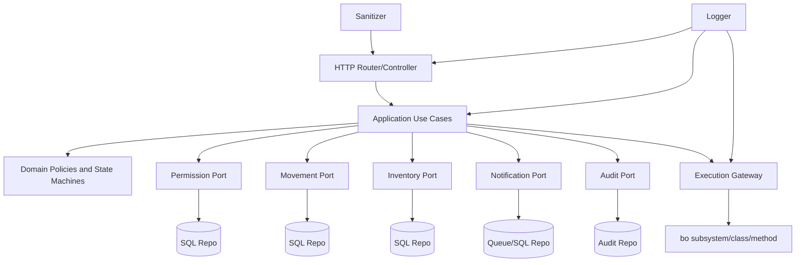

# Arquitectura Objetivo con Clean Architecture y Clean Code

## Indice
1. [Objetivo](#objetivo)
2. [Principios rectores](#principios-rectores)
3. [Capas y responsabilidades](#capas-y-responsabilidades)
4. [Patrones aplicados](#patrones-aplicados)
5. [Contratos y puertos](#contratos-y-puertos)
6. [Politica de errores](#politica-de-errores)
7. [Politica de seguridad transversal](#politica-de-seguridad-transversal)
8. [Topologia objetivo de carpetas](#topologia-objetivo-de-carpetas)
9. [Diagrama de componentes](#diagrama-de-componentes)
10. [Reglas de interoperabilidad interna](#reglas-de-interoperabilidad-interna)
11. [Referencias](#referencias)

## Objetivo
Definir una arquitectura desacoplada, mantenible e interoperable que conserve compatibilidad con el backend actual y acelere la evolucion bo-first.

## Principios rectores
1. Un caso de uso por intencion de negocio.
2. Dependencias dirigidas hacia adentro (hacia dominio).
3. Sin logica de negocio en controladores, rutas o repositorios.
4. Seguridad, auditoria y sanitizacion como politicas transversales.
5. Contratos explicitos de entrada/salida y errores tipados.
6. Estado interno encapsulado y no expuesto por API.

## Capas y responsabilidades
### Interface Adapters
1. Reciben request y validan contrato.
2. Invocan caso de uso.
3. Traducen resultado a respuesta HTTP.

### Application
1. Orquestan dominio y puertos.
2. Gestionan transacciones de negocio.
3. Publican eventos internos.

### Domain
1. Entidades y value objects.
2. Politicas de negocio y reglas invariantes.
3. Maquinas de estado de procesos.

### Infrastructure
1. Repositorios SQL.
2. Scheduler, notificador, cache.
3. Adaptadores de logger y sanitizer.

## Patrones aplicados
1. Clean architecture.
2. Hexagonal architecture (ports and adapters).
3. Strangler pattern para migracion gradual legacy -> bo.
4. CQRS ligero para reportes de solo lectura.
5. Domain events internos para desacoplar notificaciones/auditoria.
6. Unit of work en operaciones de cambio critico.

## Contratos y puertos
### Puertos de aplicacion
1. PermissionRepositoryPort.
2. TransactionRouteRepositoryPort.
3. UserProfileRepositoryPort.
4. MovementRepositoryPort.
5. InventoryRepositoryPort.
6. MaintenanceRepositoryPort.
7. CompensationRepositoryPort.
8. NotificationRepositoryPort.
9. AuditRepositoryPort.
10. PeriodRepositoryPort.

### Contratos base sugeridos
```txt
PermissionKey = lower(subsystem) + '::' + lower(class) + '::' + lower(method) + '::' + lower(profile)

TransactionRoute = {
  id: string,
  subsystem: string,
  className: string,
  methodName: string
}

UseCaseResult = {
  statusCode: number,
  code: string,
  message: string,
  data?: object,
  meta?: object
}
```

## Politica de errores
1. Error de dominio: violacion de regla de negocio, mapeado a 4xx.
2. Error de autorizacion: acceso denegado por perfil/permiso.
3. Error de infraestructura: base de datos, red o integracion externa.
4. Error inesperado: mapeado a 500 con mensaje generico.

Clases sugeridas:
1. DomainValidationError.
2. NotAuthorizedError.
3. NotFoundRouteError.
4. ConflictStateError.
5. InfrastructureError.

## Politica de seguridad transversal
1. Sanitizar payload antes de validacion de negocio.
2. Resolver identidad de sesion antes de autorizacion.
3. Autorizar por transaction_id y perfil.
4. Auditar toda operacion sensible.
5. Enmascarar secretos en logs.

## Topologia objetivo de carpetas
```txt
backend/src/
  application/
    use-cases/
    dto/
  domain/
    entities/
    value-objects/
    policies/
    state-machines/
  infrastructure/
    repositories/
    cache/
    scheduler/
    notifications/
  interfaces/
    http/
      routes/
      controllers/
      mappers/
  bo/
    subsystem/
    class/
    method/
    method_registry.js
    method_resolver.js
  shared/
    errors/
    logger/
    sanitizer/
    tracing/
```

## Diagrama de componentes


## Reglas de interoperabilidad interna
1. Ninguna clase de dominio importa Express o DBMS.
2. Ningun repositorio decide reglas de negocio.
3. Ningun caso de uso accede directamente a query strings.
4. Toda llamada cross-domain pasa por caso de uso o evento.
5. Todos los metodos compartidos en bo/method son stateless.

## Referencias
1. [00-indice-general.md](./00-indice-general.md)
2. [04-subsistemas-clases-metodos.md](./04-subsistemas-clases-metodos.md)
3. [05-estados-internos-y-privacidad.md](./05-estados-internos-y-privacidad.md)
4. [docs/permissions-mapas/03-analisis-clean-architecture.md](../permissions-mapas/03-analisis-clean-architecture.md)
5. [docs/permissions-mapas/04-plan-migracion-business-a-bo.md](../permissions-mapas/04-plan-migracion-business-a-bo.md)
