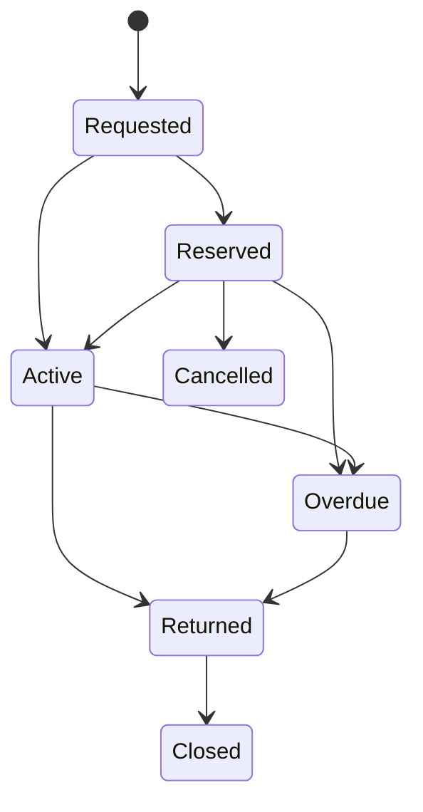

# Estados Internos, Encapsulamiento y Proteccion de Datos

## Indice
1. [Objetivo](#objetivo)
2. [Principios de manejo de estado](#principios-de-manejo-de-estado)
3. [Maquinas de estado por dominio](#maquinas-de-estado-por-dominio)
4. [Politica de datos internos no expuestos](#politica-de-datos-internos-no-expuestos)
5. [Transiciones validas e invalidas](#transiciones-validas-e-invalidas)
6. [Controles de integridad por cambio de estado](#controles-de-integridad-por-cambio-de-estado)
7. [Eventos internos sugeridos](#eventos-internos-sugeridos)
8. [Referencias](#referencias)

## Objetivo
Definir como gestionar estado interno del sistema sin exponer detalles sensibles, preservando integridad funcional y seguridad de datos.

## Principios de manejo de estado
1. Todo cambio de estado pasa por servicio de dominio, nunca directo por repositorio.
2. Toda transicion debe validar precondiciones y postcondiciones.
3. Estados tecnicos internos no se serializan en API publica.
4. Cada transicion relevante genera evento de auditoria.
5. Se bloquean transiciones ilegales por conflicto o secuencia invalida.

## Maquinas de estado por dominio
### Movimiento de prestamo
Estados:
1. Requested.
2. Reserved.
3. Active.
4. Overdue.
5. Returned.
6. Closed.
7. Cancelled.

### Devolucion
Estados:
1. Received.
2. PendingInspection.
3. ReturnedOk.
4. ReturnedLate.
5. Damaged.
6. Lost.
7. Settled.

### Compensacion
Estados:
1. Initiated.
2. PartialPaid.
3. FullyPaid.
4. PhysicalReplacementPending.
5. Closed.

### Mantenimiento
Estados:
1. Created.
2. Scheduled.
3. InProgress.
4. Paused.
5. Completed.
6. Cancelled.

### Notificacion
Estados:
1. Draft.
2. Queued.
3. Sent.
4. Delivered.
5. Read.
6. Failed.
7. Retrying.

## Politica de datos internos no expuestos
### Datos internos de seguridad
1. Hash de clave de permiso calculada.
2. Version de cache de permisos.
3. Umbral de denegaciones por usuario.
4. Marcadores de heuristica de riesgo.

### Datos internos de operacion
1. Locks de inventario por fila.
2. Token de idempotencia por transaccion.
3. Resultado de chequeos de consistencia interna.
4. Motivos tecnicos de reintento de notificaciones.

### Datos internos de dominio
1. Score interno de dano/perdida.
2. Algoritmo de calculo de multa vigente.
3. Flags de reconciliacion pendiente.
4. Version de politica de solvencia aplicada.

## Transiciones validas e invalidas
### Ejemplos validos
1. Reserved -> Active cuando existe disponibilidad y usuario solvente.
2. Active -> Returned con registro de fecha real y detalle.
3. ReturnedLate -> Settled cuando compensacion queda cerrada.

### Ejemplos invalidos
1. Closed -> Active.
2. Cancelled -> Returned.
3. FullyPaid -> Initiated.
4. Completed -> InProgress sin reapertura formal.

## Controles de integridad por cambio de estado
1. Validar periodo academico activo en operaciones academicas.
2. Validar perfil y permiso para transiciones sensibles.
3. Registrar auditoria de quien, cuando y por que.
4. Ejecutar en transaccion DB cuando involucra multiples tablas.
5. Rechazar cambios concurrentes con control de version o lock.

## Eventos internos sugeridos
1. LoanCreated.
2. ReservationExpired.
3. LoanOverdueDetected.
4. ReturnRegistered.
5. ReturnClassifiedDamaged.
6. CompensationSettled.
7. MaintenanceCompleted.
8. ItemConditionChanged.
9. UserSolvencyChanged.
10. PermissionCacheRefreshed.
11. NotificationQueued.
12. NotificationFailed.

## Referencias
1. [04-subsistemas-clases-metodos.md](./04-subsistemas-clases-metodos.md)
2. [07-gobernanza-riesgos-pruebas-metricas.md](./07-gobernanza-riesgos-pruebas-metricas.md)
3. [db-win/schema.sql](../../db-win/schema.sql)
