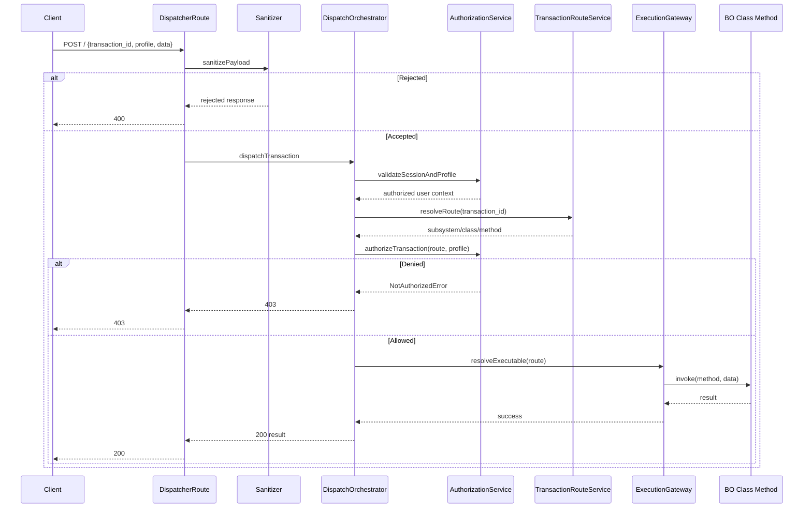
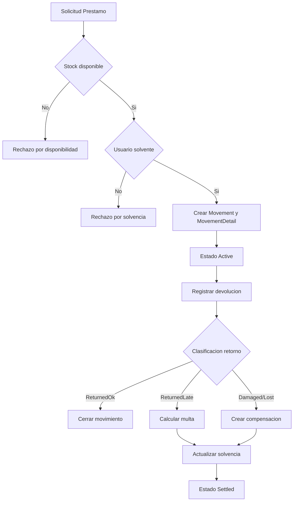
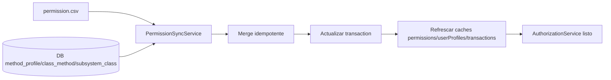
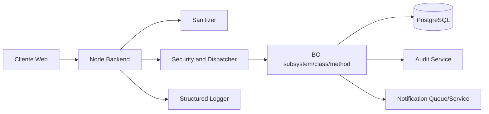
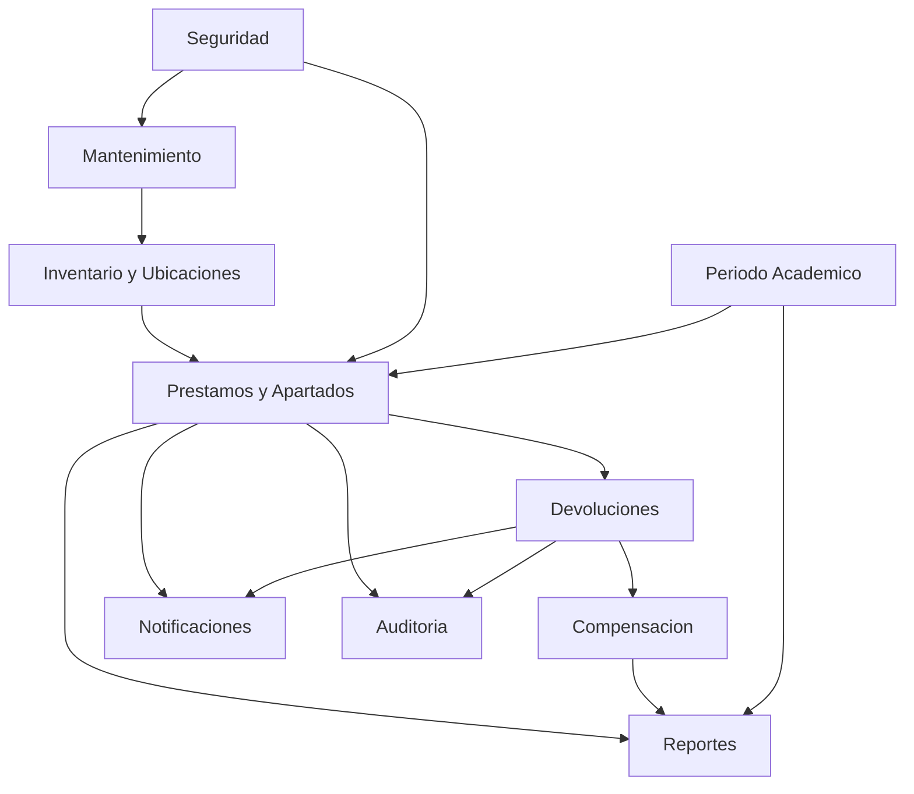

# Anexos Visuales: Diagramas de Secuencia, Componentes y Despliegue

## Indice
1. [Objetivo](#objetivo)
2. [Diagrama E2E de autorizacion y ejecucion](#diagrama-e2e-de-autorizacion-y-ejecucion)
3. [Diagrama de flujo de prestamo-devolucion-compensacion](#diagrama-de-flujo-de-prestamo-devolucion-compensacion)
4. [Diagrama de sincronizacion de permisos](#diagrama-de-sincronizacion-de-permisos)
5. [Diagrama de despliegue logico backend](#diagrama-de-despliegue-logico-backend)
6. [Diagrama de interacciones de procesos minimos](#diagrama-de-interacciones-de-procesos-minimos)
7. [Leyenda de simbolos](#leyenda-de-simbolos)
8. [Referencias](#referencias)

## Objetivo
Aportar vistas visuales que aceleren comprension del flujo de informacion, dependencias de componentes y oportunidades de optimizacion.

## Diagrama E2E de autorizacion y ejecucion

## Diagrama de flujo de prestamo-devolucion-compensacion

## Diagrama de sincronizacion de permisos

## Diagrama de despliegue logico backend

## Diagrama de interacciones de procesos minimos

## Leyenda de simbolos
1. Rectangulo: servicio o componente.
2. Rombo: decision de negocio.
3. Cilindro: persistencia.
4. Flecha: flujo de dependencia o datos.

## Referencias
1. [00-indice-general.md](./00-indice-general.md)
2. [03-arquitectura-objetivo-clean.md](./03-arquitectura-objetivo-clean.md)
3. [04-subsistemas-clases-metodos.md](./04-subsistemas-clases-metodos.md)
4. [05-estados-internos-y-privacidad.md](./05-estados-internos-y-privacidad.md)
