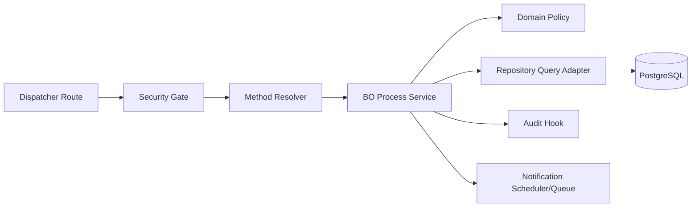
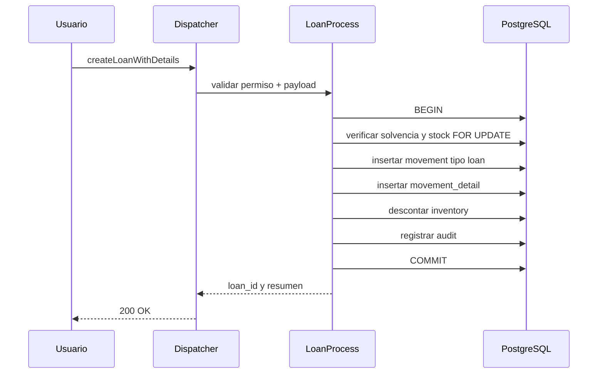
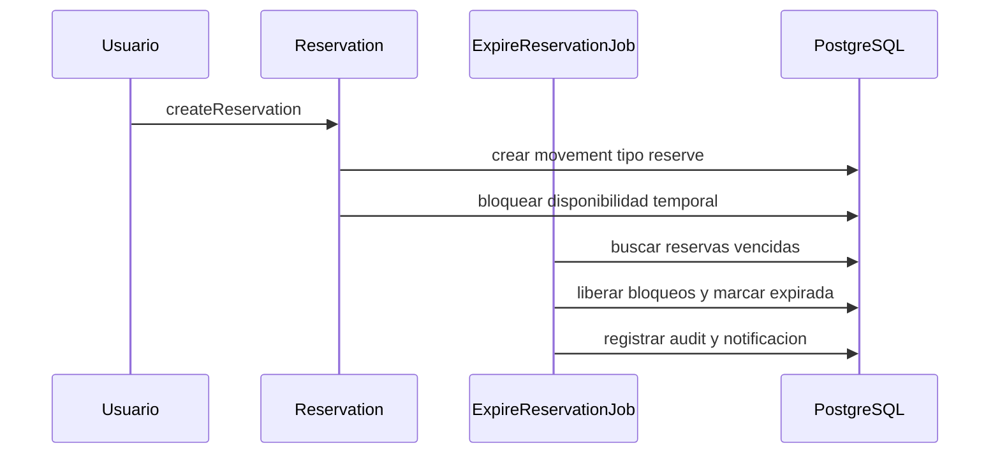
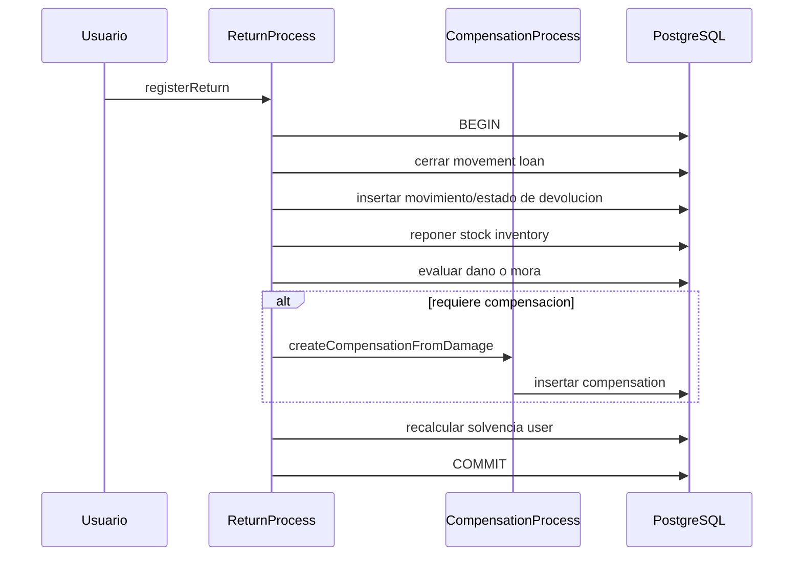

# Arquitectura Objetivo y Flujos

## 1. Objetivo arquitectonico

Evolucionar la arquitectura BO actual hacia una organizacion por procesos de negocio compuestos, preservando el dispatcher y el estilo subsystem/class/method, pero separando:

1. Capa de entrada y seguridad.
2. Casos de uso transaccionales.
3. Politicas de dominio.
4. Persistencia y adaptadores.

## 2. Diagrama de componentes



## 3. Flujos criticos

### 3.1 Flujo prestamo completo



### 3.2 Flujo apartado y expiracion



### 3.3 Flujo devolucion y compensacion



## 4. Estructura objetivo en BO

```txt
backend/src/bo/
  Loans/
    LoanProcess/
      LoanProcess.js
      methods/
        createLoanWithDetails.js
        renewLoan.js
  Reservations/
    Reservation/
      Reservation.js
      methods/
        createReservation.js
        convertReservationToLoan.js
        cancelReservation.js
    ReservationJob/
      ReservationJob.js
      methods/
        expireReservationJob.js
  Returns/
    ReturnProcess/
      ReturnProcess.js
      methods/
        registerReturn.js
  Reports/
    SolvencyReport/
    DelinquencyReport/
    LoanStatsReport/
```

## 5. Contratos de entrada recomendados

### 5.1 createLoanWithDetails

```json
{
  "user_id": 101,
  "period_id": 20261,
  "booking_date": "2026-04-01T10:00:00Z",
  "estimated_return_date": "2026-04-08T10:00:00Z",
  "observations": "Prestamo de practicas",
  "details": [
    { "inventory_id": 9001, "amount": 1 }
  ]
}
```

### 5.2 registerReturn

```json
{
  "loan_id": 345,
  "user_id": 101,
  "return_date": "2026-04-08T09:40:00Z",
  "details": [
    {
      "movement_detail_id": 780,
      "returned_amount": 1,
      "condition_status_id": 1,
      "observations": "Sin danos"
    }
  ]
}
```

## 6. Regla de compatibilidad

La propuesta mantiene el dispatcher y method resolver actuales. Los nuevos BO se integran por el mismo contrato subsystem/class/method para minimizar riesgos de migracion.
