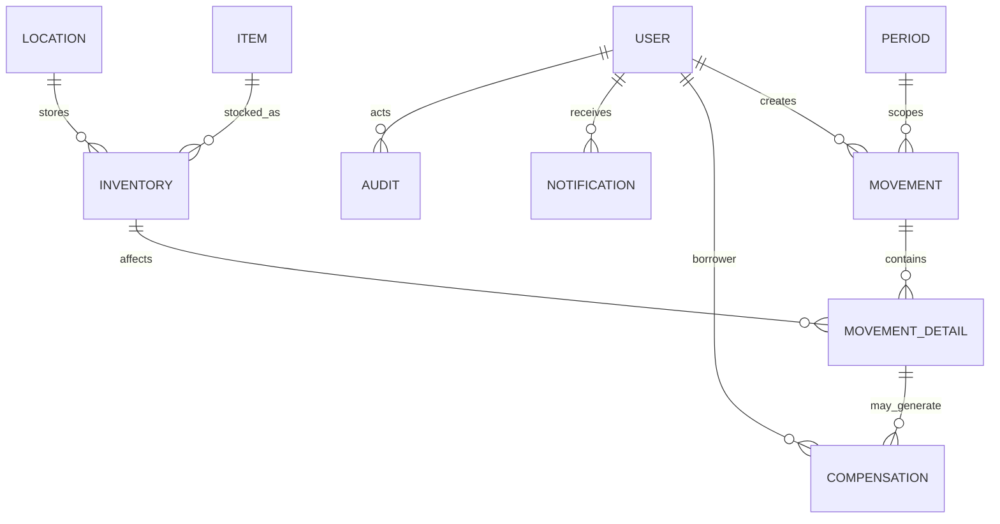
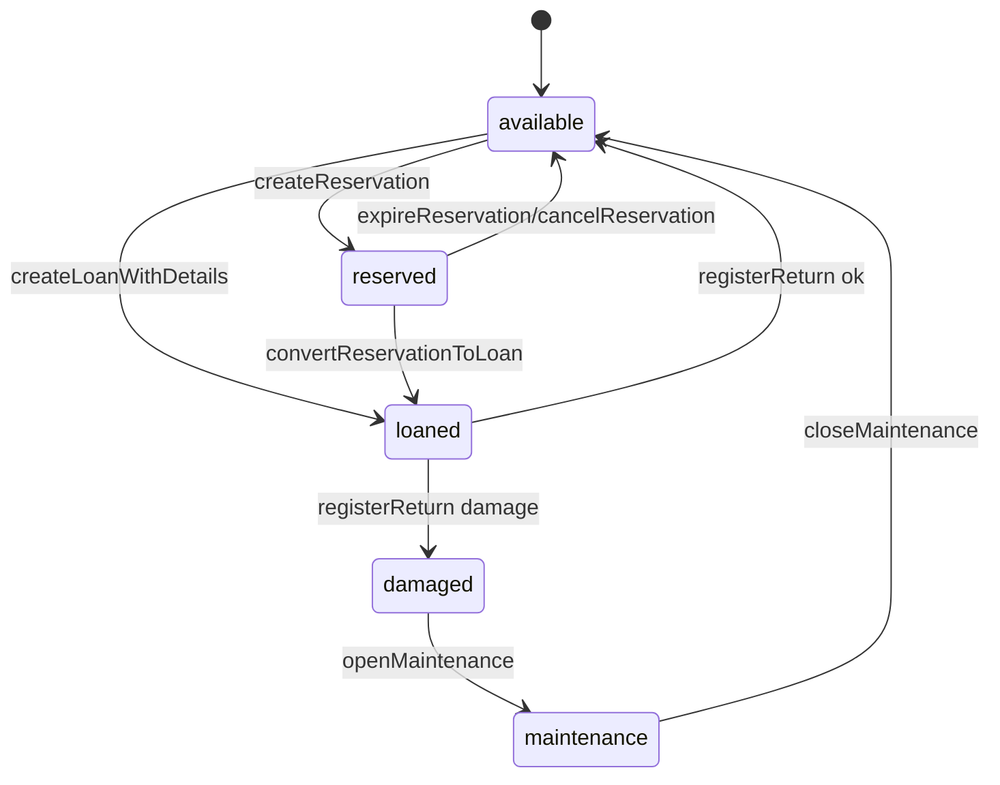
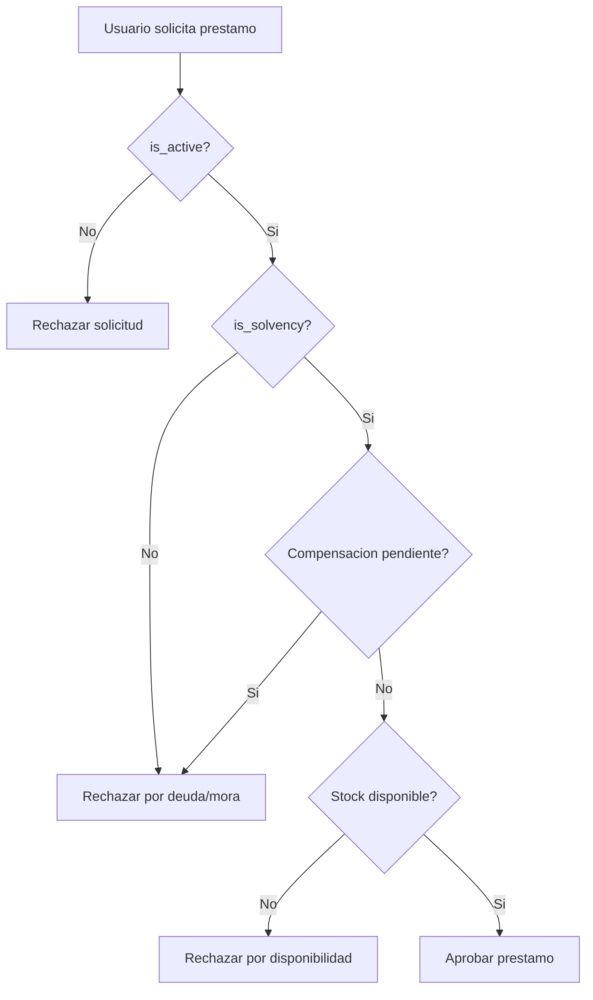

# Anexos, Diagramas y Glosario

## 1. Diagrama ER simplificado (enfoque operativo)

## 2. Diagrama de estados de item

## 3. Diagrama de decision de solvencia

## 4. Glosario

| Termino | Definicion |
| --- | --- |
| BO | Business Object, unidad de negocio expuesta por subsystem/class/method |
| Movimiento | Cabecera transaccional (loan, reserve, return) |
| Movement detail | Detalle por item/cantidad afectado por un movimiento |
| Solvencia | Estado habilitante para nuevos prestamos |
| Mora | Retraso de devolucion respecto de fecha esperada |
| Soft delete | Baja logica con deleted_at, sin eliminar fisicamente |
| Auditoria temporal | Registro de created_at y updated_at en formato TIMESTAMPTZ |

## 5. Checklist de aceptacion final

### 5.1 Funcional

1. Prestamo, apartado y devolucion operan en flujo completo.
2. Compensacion por dano/mora actualiza solvencia.
3. Notificaciones automaticas funcionan por scheduler.
4. Reportes de solvencia, morosos y estadistica disponibles.

### 5.2 Datos

1. Entidades maestras con created_at, updated_at y deleted_at segun politica.
2. Sin hard delete en entidades operativas historicas.
3. Integridad referencial validada en procesos compuestos.

### 5.3 Calidad

1. Pruebas unitarias, integracion y E2E en verde.
2. Cobertura de casos de error criticos.
3. Logs y metricas de proceso disponibles.

## 6. Siguiente artefacto recomendado

Una vez aprobado este paquete, generar un documento tecnico-operativo por sprint con:

1. Lista exacta de archivos a crear/modificar.
2. Contratos de entrada/salida por metodo.
3. Queries nuevas y migraciones SQL versionadas.
4. Casos de prueba por historia.
