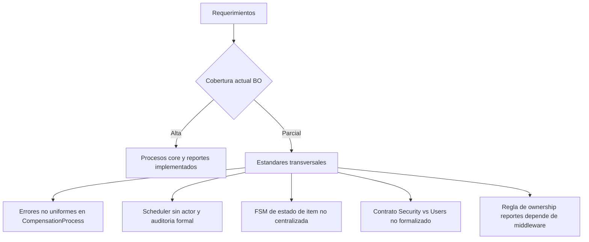

# Gap Analysis Exhaustivo Requerimientos vs BO (Version 2026-03-26)

## 1. Contexto y alcance

Este documento consolida el analisis exhaustivo entre:

1. Requerimientos de negocio:
   - ai/processes.txt
   - docs/propuesta-gap-analysis-bo/02-requerimientos-explicitos-e-implicitos.md
2. Implementacion actual BO:
   - backend/src/bo
   - backend/src/bo/method_registry.js
   - backend/src/bo/method_resolver.js
3. Evidencia de calidad:
   - Suite BO completa en verde (13 suites, 48 tests)

Objetivo: definir brechas reales remanentes para alcanzar cumplimiento formal al 100%, sin asumir decisiones de negocio no aprobadas.

## 2. Resumen ejecutivo

### 2.1 Diagnostico rapido

1. Cobertura funcional actual: alta.
2. Cobertura de procesos compuestos (prestamo/reserva/devolucion/compensacion/notificacion/reportes): implementada y validada.
3. Cobertura de estandares transversales: media-alta, con brechas puntuales de consistencia.

### 2.2 Estado actual vs deseado

| Dimension                      | Estado actual                                                                       | Estado deseado                                                |
| ------------------------------ | ----------------------------------------------------------------------------------- | ------------------------------------------------------------- |
| Procesos core ACID             | Implementados con aislamiento SERIALIZABLE y bloqueos FOR UPDATE                    | Mantener + estandarizar retries y contrato uniforme           |
| Trazabilidad de actor          | Fuerte en LoanProcess, ReturnProcess, Reservation, CompensationProcess, SolvencyJob | Uniforme tambien en scheduler y rutas batch                   |
| Seguridad                      | Ownership de reportes aprobado en middleware + matriz permission.csv                | Fortalecer pruebas de contrato middleware -> dispatcher -> BO |
| Control de estado de items     | Parcial (status de retorno y condition_status CRUD)                                 | Flujo de estados explicito y centralizado                     |
| Gobernanza de borrado          | Hard-delete bloqueado en entidades historicas clave                                 | Cierre completo de excepciones y politica unica aprobada      |
| Calidad de contrato de errores | Mixto (domainError y throws ad hoc)                                                 | Unico contrato de error transversal                           |

## 3. Fase 1 - Requerimientos explicitos e implicitos

## 3.1 Requerimientos explicitos consolidados

1. Mantenimiento de equipos.
2. Mantenimiento de componentes.
3. Prestamos.
4. Apartado de componentes o equipos.
5. Devolucion de prestamos.
6. Control del estado de equipos y componentes.
7. Compensacion por danos.
8. Notificaciones (recordatorio, alerta por retraso).
9. Inventario de componentes.
10. Inventario de equipos.
11. Mantenimiento de ubicacion de equipos.
12. Mantenimiento de ubicacion de componentes.
13. Reportes (solvencia, morosos, estadistica de prestamos).
14. Auditoria.
15. Mantenimiento de seguridad.
16. Mantenimiento de periodo academico.

## 3.2 Requerimientos implicitos descubiertos (criticidad alta)

1. Integridad transaccional de procesos compuestos multitabla.
2. Prevencion de sobreasignacion de inventario bajo concurrencia.
3. Identidad obligatoria del actor operativo en procesos de negocio.
4. Trazabilidad de auditoria de eventos de negocio criticos.
5. Recalculo consistente de solvencia ante mora y compensacion.
6. Politica de no hard-delete para datos historicos operativos.
7. Contrato uniforme de errores de dominio (422, 404, 409, 500).
8. Separacion estricta de responsabilidades: autorizacion en middleware, logica de negocio en BO.
9. Idempotencia relativa en scheduler de notificaciones (deduplicacion por ventana).
10. Cierre completo del ciclo de vida de reserva (crear, convertir, cancelar, expirar).
11. Cierre completo del ciclo de vida de prestamo (crear, renovar, devolver, marcar mora).
12. Compatibilidad formal entre BO de dominio Users y BO de seguridad SecurityUser.
13. Cobertura de pruebas para rutas happy path, conflicto y concurrencia.
14. Gobernanza de reglas transversales (soft-delete, metacampos, observabilidad).

## 4. Fase 2 - Auditoria de arquitectura BO actual

## 4.1 Cobertura fuerte detectada

1. LoanProcess:
   - createLoanWithDetails
   - renewLoan
2. Reservation + ReservationJob:
   - createReservation
   - convertReservationToLoan
   - cancelReservation
   - expireReservationJob
   - getReservationById
   - getReservationsByUser
3. ReturnProcess:
   - registerReturn
4. CompensationProcess:
   - createCompensationFromDamage
   - settleCompensation
5. NotificationScheduler:
   - sendReturnReminderBatch
   - sendOverdueAlertBatch
6. Reports:
   - getPendingLoansByUser
   - getSolvencyReport
   - getDelinquentUsers
   - getLoanStatistics
7. SolvencyJob:
   - recomputeOverdueSolvencyBatch

## 4.2 Brechas y deuda tecnica remanente

1. Inconsistencia de contrato de errores en CompensationProcess (uso mixto de Error/string JSON vs domainError).
2. Scheduler sin processed_by_user_id obligatorio y sin auditoria obligatoria de negocio.
3. Control de estados de item no centralizado en una maquina de estados formal.
4. Metodos CRUD legacy aun expuestos para dominios donde el flujo compuesto debe ser la ruta principal (con retiro planificado en 30 dias y bloqueo final).
5. AcademicPeriod create/update aun no refleja explicitamente la politica aprobada de multiples periodos activos.
6. Contrato Security vs Users requiere formalizar replicacion de Security desde fuente canonica Users.
7. Falta test explicito de contrato middleware->BO para ownership de reportes.

## 5. Matriz de desarrollo propuesta (cierre de brechas)

| Requerimiento                           | Subsistema            | Clase                       | Metodo                                                      | Descripcion de la logica                                                                                   | Estado       |
| --------------------------------------- | --------------------- | --------------------------- | ----------------------------------------------------------- | ---------------------------------------------------------------------------------------------------------- | ------------ |
| Contrato uniforme de errores            | Compensations         | CompensationProcess         | createCompensationFromDamage                                | Migrar throws ad hoc a throwDomainError/rethrowAsDomainError con codigos canonicos                         | Modificacion |
| Contrato uniforme de errores            | Compensations         | CompensationProcess         | settleCompensation                                          | Igualar validaciones y mapeo de errores al contrato transversal BO                                         | Modificacion |
| Trazabilidad actor en jobs              | Notifications         | NotificationScheduler       | sendReturnReminderBatch                                     | Requerir processed_by_user_id obligatorio segun decision aprobada y persistir actor en resultado/auditoria | Modificacion |
| Trazabilidad actor en jobs              | Notifications         | NotificationScheduler       | sendOverdueAlertBatch                                       | Requerir processed_by_user_id obligatorio segun decision aprobada y persistir actor en resultado/auditoria | Modificacion |
| Auditoria de ejecucion scheduler        | Notifications         | NotificationScheduler       | sendReturnReminderBatch                                     | Auditoria obligatoria: candidate_count, created_count, skipped_dedup_count, dedup_hours, window_hours      | Modificacion |
| Auditoria de ejecucion scheduler        | Notifications         | NotificationScheduler       | sendOverdueAlertBatch                                       | Auditoria obligatoria: candidate_count, created_count, skipped_dedup_count, dedup_hours                    | Modificacion |
| Control de estado de items              | Inventory             | ItemStatusFlow              | transitionItemStatus                                        | Introducir FSM formal para transiciones validas: available/reserved/loaned/damaged/maintenance             | Nuevo        |
| Gobernanza de rutas de negocio          | Loans                 | Loan                        | createLoan/updateLoan/deleteLoan (+ consultas legacy)       | Aplicar ventana de transicion de 30 dias y bloqueo final en favor de LoanProcess                           | Modificacion |
| Gobernanza de rutas de negocio          | Returns               | Return                      | createReturn/updateReturn/deleteReturn (+ consultas legacy) | Aplicar ventana de transicion de 30 dias y bloqueo final en favor de ReturnProcess                         | Modificacion |
| Contrato middleware->BO reportes        | Security              | SecurityBridge              | authorizeProcessAction                                      | Mantener ownership en middleware (aprobado) y agregar pruebas de contrato para evitar regresion            | Modificacion |
| Solidez seguridad-operacion             | Security + Users      | SecurityUser/User           | sincronizacion de datos de identidad                        | Formalizar Users canonico -> Security replica con pruebas de consistencia                                  | Modificacion |
| Politica de periodos academicos         | Academic              | AcademicPeriod              | createAcademicPeriod/updateAcademicPeriod                   | Ajustar validaciones para permitir multiples periodos activos sin romper integridad de fechas              | Modificacion |
| Estandar obligatorio de errores         | CrossCutting          | DomainErrorPolicy           | enforceDomainErrorContract                                  | Obligar domainError en 100% de BO, incluyendo rutas legacy y scheduler                                     | Nuevo        |
| Cobertura de pruebas de reservas nuevas | Testing BO            | tests/bo                    | suite reservation retrieval/cancel                          | Agregar casos de getReservationById/getReservationsByUser/cancelReservation (happy/conflict/auth)          | Nuevo        |
| Cobertura de pruebas de solvency job    | Testing BO            | tests/bo                    | suite solvency job                                          | Agregar casos de recomputeOverdueSolvencyBatch con candidatos, cambios y auditoria                         | Nuevo        |
| Cobertura de pruebas contrato seguridad | Testing BO/Dispatcher | tests/bo + tests/dispatcher | ownership report contract tests                             | Verificar que rechazo de acceso cruzado viva en middleware y no se rompa por regresion                     | Nuevo        |

## 6. Diagrama de brecha remanente

## 7. Consideraciones finales (riesgos y recomendaciones)

## 7.1 Riesgos detectados

1. Riesgo transitorio de inconsistencia funcional durante la ventana de coexistencia de 30 dias entre rutas CRUD legacy y rutas de proceso.
2. Riesgo de auditoria incompleta en automatizaciones de scheduler mientras no se implemente la regla obligatoria aprobada.
3. Riesgo de divergencia entre dominio Users y dominio SecurityUser mientras no se formalice el flujo canonico->replica.
4. Riesgo de regresion de seguridad si no se testea ownership en middleware.

## 7.2 Recomendaciones arquitectonicas

1. Ejecutar plan de retiro Q4: coexistencia de 30 dias y bloqueo final de rutas legacy Loan/Return para consolidar Process-first.
2. Implementar en Fase 4 el estandar transversal obligatorio de scheduler con actor + auditoria.
3. Cerrar contratos de seguridad con pruebas de integracion middleware->dispatcher->BO.
4. Ajustar AcademicPeriod a politica aprobada: multiples periodos activos.
5. Estandarizar domainError de forma obligatoria en todo BO.

## 8. Resultado esperado tras aprobaciones

Con las decisiones Q1-Q8 ya aprobadas, incluyendo Q4 (transicion legacy de 30 dias y bloqueo final), el cierre al 100% depende de ejecutar disciplinadamente el hardening y la migracion operativa en ventana controlada.
